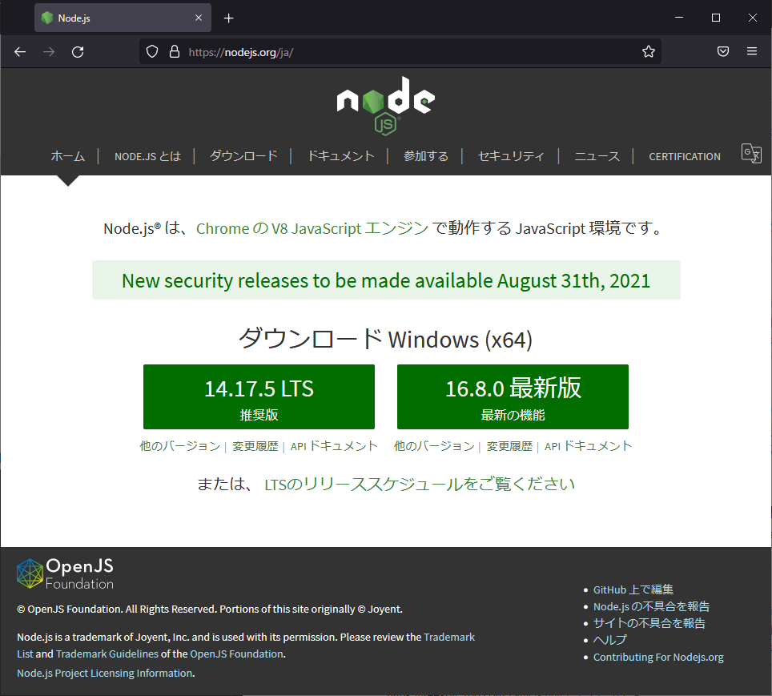
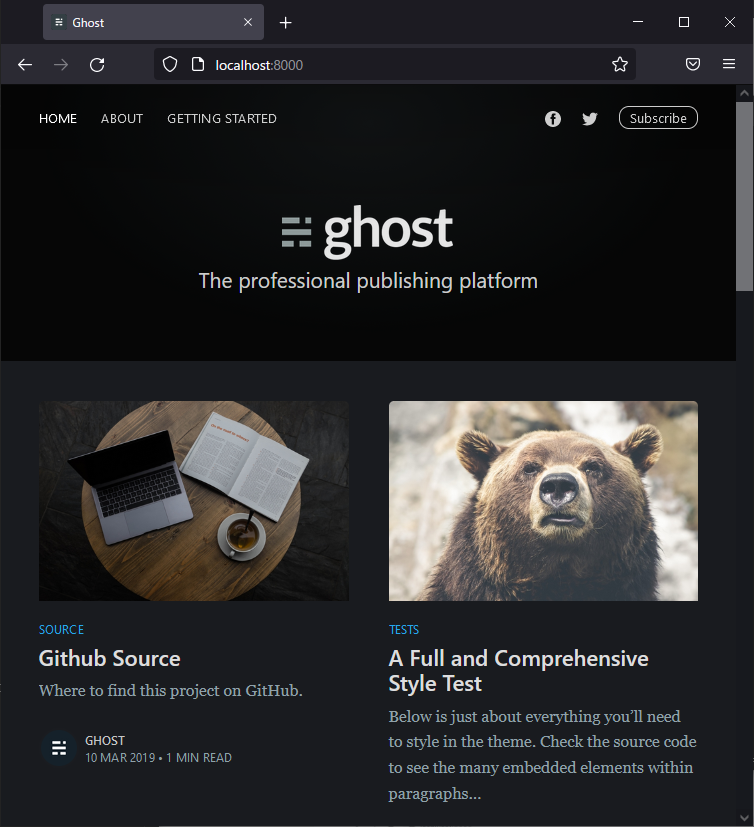
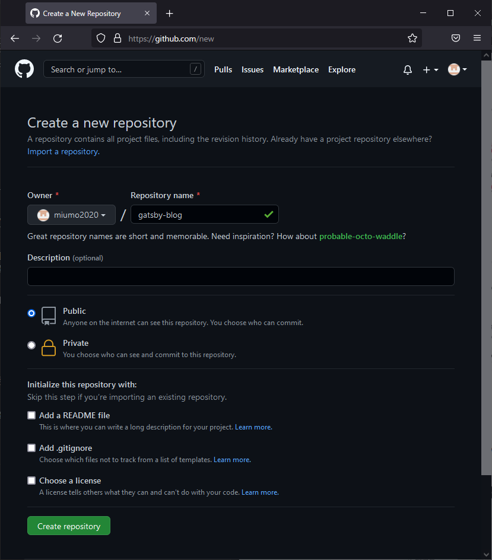

## はじめに

これまでコードの覚書や手順の記録は、GitHubのリポジトリで完全自分用として管理していました。が、これらを公開することで誰かの参考になるかもという淡い期待と、なにより自分の勉強のためにもブログを構築してみることにしました。<br>
少し調べてみると、なにやらGatsbyという静的サイトジェネレータが便利らしいので、こちらを使ってGitHub Pagesでブログを公開してみました。

Node.js、Gatsbyに関しては知識が乏しいので、ひとまず記録のため表面的な手順のみ記載しますが、今後知見が溜まってきたら記事を更新/補足して行きたいと思っています。

- [公式チュートリアル](https://www.gatsbyjs.com/docs/tutorial/)

### 前提条件

- Windows 10 Home
- Node.js v16.8.0.
- npm --version 7.21.0
Gitインストール、GitHubアカウント作成は説明を省略します。


## 準備

### Node.jsインストール

公式サイトからインストーラをダウンロードします。
今回は最新版をインストールしました。

[https://nodejs.org/ja/](https://nodejs.org/ja/)




### Gatsbyインストール

[公式チュートリアル](https://www.gatsbyjs.com/docs/tutorial/part-0/)等、参考にしたウェブサイトは`shell±.npm install -g gatsby-cli`としてグローバルにインストールしているものがほとんどでしたが、私はGatsby用のパッケージフォルダを作成しました。

```shell
npm init
npm install gatsby-cli
```


### Gatsby Starterを使ってサイト生成

まず、[Gatsby Starter Library](https://www.gatsbyjs.com/starters-next)から、気に入ったStarterを選択します。
Gatsbyは一からスタイルを構築することもできますが、Starterを使えば既に構築済みのテンプレートを利用して手軽に始めることが出来ます。<br>
私はビジュアルが気に入ったので[gatsby-casper](https://www.gatsbyjs.com/starters-next/scttcper/gatsby-casper/)を採用しました。
ダークモード表示がなかなかスタイリッシュで良い感じです。
またTypeScript化されているので、このStarterを触りながらTypeScript+Reactも勉強したい、というのが選定理由の一つです。

CLIコマンドを実行しサイト生成します。

```shell
npx gatsby new blog https://github.com/scttcper/gatsby-casper
```


サイト名「blog」は任意です。

生成が完了したらディレクトリ移動し、開発用サーバを起動します。

```shell
cd blog
npx gatsby develop
```

ブラウザで[http://localhost:8000/](http://localhost:8000/)にアクセスし、以下の様な画面が表示されれば成功です。




## デプロイ作業

### GitHub Pagesの設定

GitHub → New Repository → 任意のRepository name入力 → Create repository



```basshellh
cd blog
npx gatsby develop
```

### ソースコードの修正


- ページネーションの設定
gatsby-node.js
```js
  // Create paginated index
  // TODO: new pagination
  const postsPerPage = 11;
```

- 日本語フォントの設定

PostCard.tsx
```js
const PostCardExcerpt = styled.section`
  // font-family: Georgia, serif;
  font-family: Georgia, "Yu Gothic", serif;
      :
      :
```

PostContent.tsx
```tsx{1,4-6}
export const PostFullContent = styled.section`
+ position: relative;
- margin: 0 auto;
  padding: 0 170px 6vw;
  min-height: 230px;
  // font-family: Georgia, serif;
  font-family: "Yu Gothic", Georgia, serif;
  font-size: 2rem;
  line-height: 1.6em;
  background: #fff;
      :
      :
```


```diff-javascript
@@ -4,6 +4,5 @@
-    let foo = bar.baz([1, 2, 3]);
-    foo = foo + 1;
+    const foo = bar.baz([1, 2, 3]) + 1;
     console.log(`foo: ${foo}`);
```