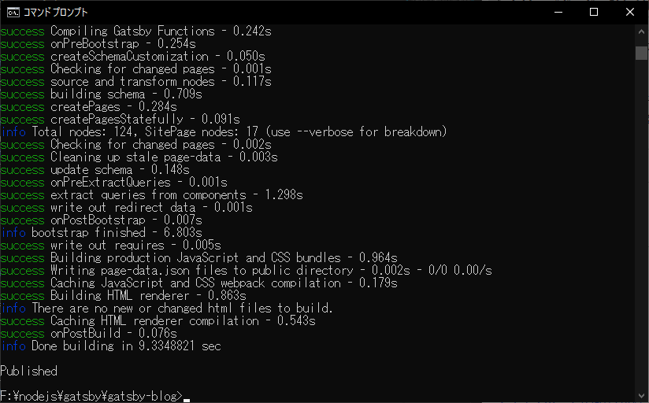
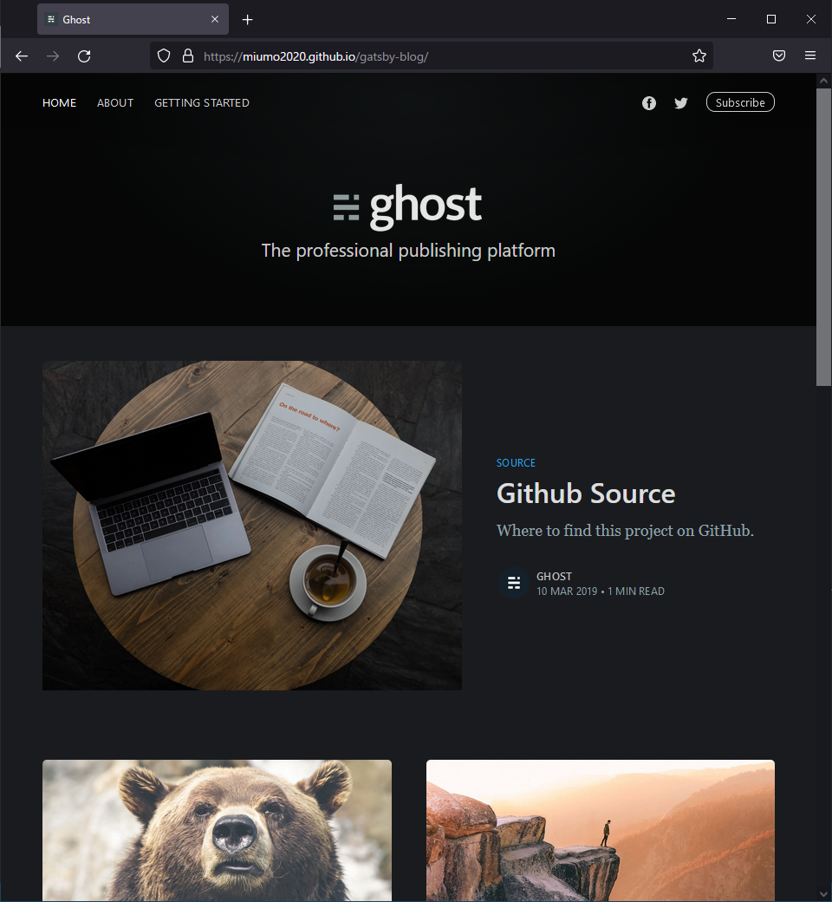

## はじめに

これまでコードの覚書や手順の記録は、GitHub のリポジトリで完全自分用として管理していました。が、これらを公開することで誰かの参考になるかもという淡い期待と、なにより自分の勉強のためにもブログを構築してみることにしました。<br>
少し調べてみると、なにやら Gatsby という静的サイトジェネレータが便利らしいので、こちらを使って GitHub Pages でブログを公開してみました。

Node.js、Gatsby に関しては知識が乏しいので、ひとまず記録のため表面的な手順のみ記載しますが、今後知見が溜まってきたら記事を更新/補足して行きたいと思います。

- [公式チュートリアル](https://www.gatsbyjs.com/docs/tutorial/)

### 前提条件

- Windows 10 Home
- Node.js v16.8.0.
- npm --version 7.21.0

  Git インストール、GitHub アカウント作成は説明を省略します。

## 準備

### Node.js インストール

公式サイトからインストーラをダウンロードします。
今回は最新版をインストールしました。

[https://nodejs.org/ja/](https://nodejs.org/ja/)


私は今回、そもそも Node.js とは何ぞや？という状態からスタートしましたが、こちらの記事が Node.js を疑問を解消するのに大変役立ちました。

Qiita -- Node.js とはなにか？なぜみんな使っているのか？
[https://qiita.com/non_cal/items/a8fee0b7ad96e67713eb](https://qiita.com/non_cal/items/a8fee0b7ad96e67713eb)

### Gatsby インストール

[公式チュートリアル](https://www.gatsbyjs.com/docs/tutorial/part-0/)等、参考にしたウェブサイトは`shell±.npm install -g gatsby-cli`としてグローバルにインストールしているものがほとんどでしたが、私は Gatsby 用のパッケージフォルダを作成しました。
グローバルは汚さない方が良いと考えこのようにしましたが、CLI ツールなのでグローバルで問題無かったかもしれません。

```shell
cd nodejs\gatsby
npm init
npm install gatsby-cli
```

### Gatsby Starter を使ってサイト生成

[Gatsby Starter Library](https://www.gatsbyjs.com/starters-next)から、気に入った Starter を選択します。
Gatsby は一からスタイルを構築することもできますが、Starter を使えば既に構築済みのテンプレートを利用して手軽に始めることが出来ます。<br>
私はビジュアルが気に入ったので[gatsby-casper](https://www.gatsbyjs.com/starters-next/scttcper/gatsby-casper/)を採用しました。
ダークモード表示がなかなかスタイリッシュで良い感じです。
また TypeScript 化されているので、この Starter を触りながら TypeScript+React も勉強したい、というのが選定理由の一つです。

CLI コマンドを実行しサイト生成します。

```shell
npx gatsby new gatsby-blog https://github.com/scttcper/gatsby-casper
```

パッケージ名「gatsby-blog」は任意です。<br>
生成が完了したらディレクトリ移動し、開発用サーバを起動します。

```shell
cd gatsby-blog
npx gatsby develop
```

ブラウザで[http://localhost:8000/](http://localhost:8000/)にアクセスし、以下の様な画面が表示されれば成功です。


### GitHub リポジトリの作成

GitHub で新規リポジトリを作成します。
New Repository → 任意の Repository name 入力 → Create repository


## デプロイ作業

公式チュートリアルの内容に沿って進めました。<br>
[How Gatsby Works with GitHub Pages](https://www.gatsbyjs.com/docs/how-to/previews-deploys-hosting/how-gatsby-works-with-github-pages/)

### gh-pages インストール

```shell
npm install gh-pages --save-dev
```

`gatsby-config.js`の pathPrefix に リポジトリ名を追加します。
GitHub Pages のルートディレクトリは、https://<ユーザー名>.github.io/<リポジトリ名>/となるため、pathPrefix を忘れると正常にページが表示されなくなります。

```diff-javascript
module.exports = {
+ pathPrefix: "/gatsby-blog",
  siteMetadata: {
    :
    :
```

`package.json`に deploy コマンドを追加します。

```diff-javascript
{
    :
    :
  "scripts": {
    "build": "gatsby build",
    "dev": "gatsby develop",
    "lint": "eslint --ext .js,.ts,.tsx .",
    "lint:fix": "eslint --fix --ext .js,.ts,.tsx .",
    "start": "npm run dev",
    "test": "echo \"Error: no test specified\" && exit 1",
+   "deploy": "gatsby build --prefix-paths && gh-pages -d public"
  },
    :
    :
```

### GitHub Pages へデプロイ

GitHub のリモートリポジトリと連携し、push します。
変更箇所もローカルリポジトリにコミットしておきます。

```shell
git add .
git commit -m "Update: gh-pages install"
git remote add origin https://github.com/<ユーザー名>/<リポジトリ名>.git
git push -u origin main
```

`package.json`に 追加した deploy コマンドを実行します。
コマンドライン上に Published と表示されれば成功です。

```shell
npm run deploy
```



https://<ユーザー名>.github.io/<リポジトリ名>/ にアクセスし、ページが表示されるか確認します。
GitHub リポジトリにアクセスし、Setting → Pages を確認すれば、 Your site is published at … というリンクがあるので、そちらからも確認できます。



## さいごに

ひとまず完了になります。<br>
実際の運用にはStarterのカスタマイズが必要になりますが、記事にできそうな内容があればまた書いていきます。
また、今後は独自ドメインも設定したいです。