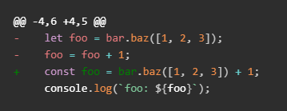
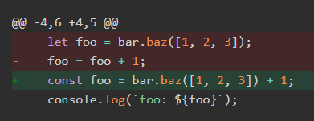
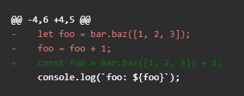
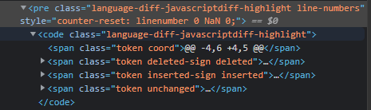

## はじめに

このブログは、[gatsby-casper](https://www.gatsbyjs.com/starters-next/scttcper/gatsby-casper/)を基に作られています
(ブログ構築時の記録は[以前の記事](/2021/08/27/start-blog/)を参照)。
Markdownのコード追加/削除の表示をGitHubライクにしたかったのですが、上手くいきませんでした。

- Before



- After




## 試したこと

[gatsby-casper](https://www.gatsbyjs.com/starters-next/scttcper/gatsby-casper/)には既に必要なモジュールはインストール済みでした。

```js
    "gatsby-transformer-remark": "4.0.0",
    "gatsby-remark-prismjs": "5.0.0",
    "prismjs": "1.23.0",
```


[https://www.gatsbyjs.com/plugins/gatsby-remark-prismjs/](https://www.gatsbyjs.com/plugins/gatsby-remark-prismjs/)を参考にコードを改修します。

### gatsby-config.js修正

```diff-js diff-highlight
    {
      resolve: 'gatsby-transformer-remark',
      options: {
        plugins: [
          {
            resolve: 'gatsby-remark-responsive-iframe',
            options: {
              wrapperStyle: 'margin-bottom: 1rem',
            },
          },
-         'gatsby-remark-prismjs',
+         {
+           resolve: `gatsby-remark-prismjs`,
+           options: {
+             classPrefix: "language-",
+             inlineCodeMarker: null,
+             aliases: {},
+             showLineNumbers: false,
+             noInlineHighlight: false,
+           },
+         },
          'gatsby-remark-copy-linked-files',
          'gatsby-remark-smartypants',
          'gatsby-remark-reading-time',
          {
            resolve: 'gatsby-remark-images',
            options: {
              maxWidth: 2000,
              quality: 100,
            },
          },
        ],
      },
    },

```

### gatsby-browser.js作成

プロジェクト直下にgatsby-browser.jsを作成。

```js
require("prismjs/themes/prism-tomorrow.css");
require("prismjs/plugins/diff-highlight/prism-diff-highlight.css");
```

### component修正

src/components/PostContent.tsx内にシンタックスハイライト用のcssスタイルが既に記述されていました。私はここのコードをそのまま残しましたが、PrismJSのスタイルを使いたければ削除します。


## 実際に確認してみる

[https://prismjs.com/plugins/diff-highlight/](https://prismjs.com/plugins/diff-highlight/)を参考にMarkdownを作成。（実際にはエスケープ「\」は入力しないよう注意します）

```
\```diff-javascript diff-highlight
@@ -4,6 +4,5 @@
-    let foo = bar.baz([1, 2, 3]);
-    foo = foo + 1;
+    const foo = bar.baz([1, 2, 3]) + 1;
     console.log(`foo: ${foo}`);
\```
```

開発サーバを立ち上げて、http://localhost:8000 を確認。

```
npx gatsby develop
```

- Result



あれ？なんか表示が思っていたのと違う…<br>
ブラウザの開発モードでDOMを確認すると、



何故かクラス属性の「language-diff-javascript」と「diff-highlight」の間に空白が無く、文字が結合されています。Markdownの変換周りを見直す必要がありそう…<br>
今日のところはここまで。


