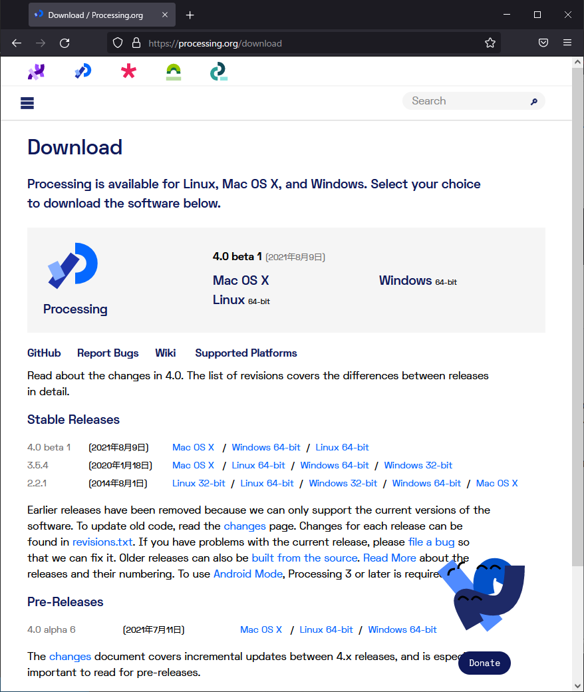
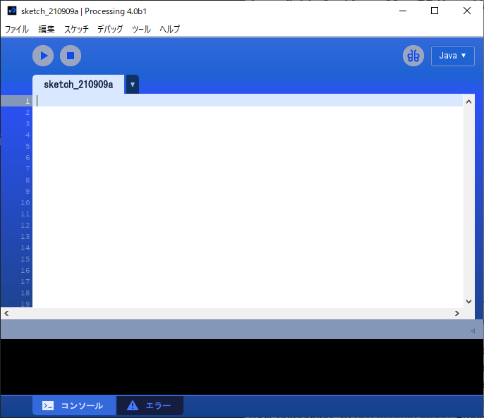
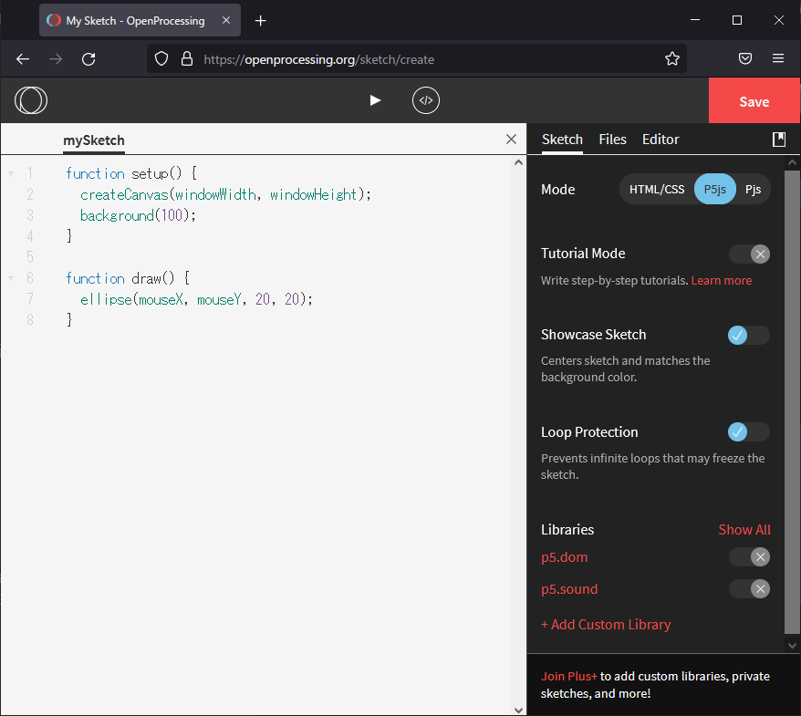

## はじめに

### Processingインストール

[https://processing.org/download](https://processing.org/download)にアクセスし、zipファイルをダウンロード。私は4.0 beta 1、Windows 64-bit版を選択しました。

zipファイルを解凍し、processing.exeを実行。
Processingを起動すると、下記の様なIDEが表示されます。

### OpenProcessingについて

手っ取り早く始めたければ、Web上で動作するOpenProcessingを使うのも手です。
[https://openprocessing.org/](https://openprocessing.org/)にアクセスし、画面右上にある「Create a Sketch」をクリックすると、下記の様なエディタが表示されます。

