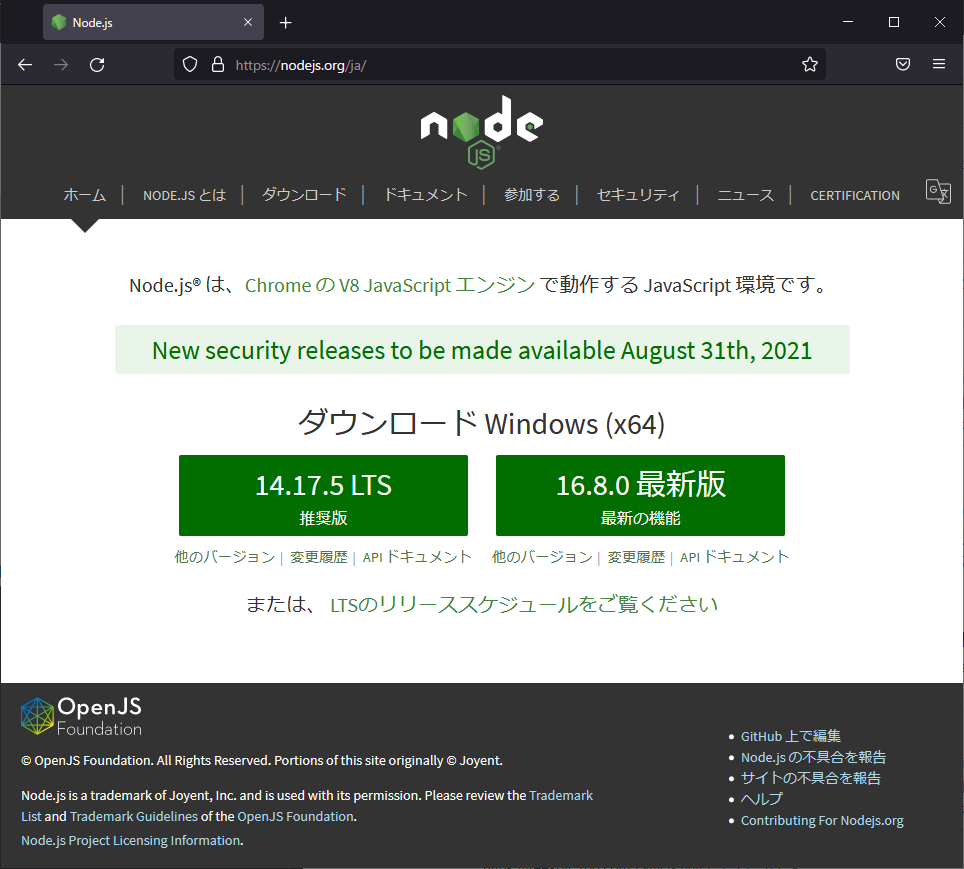
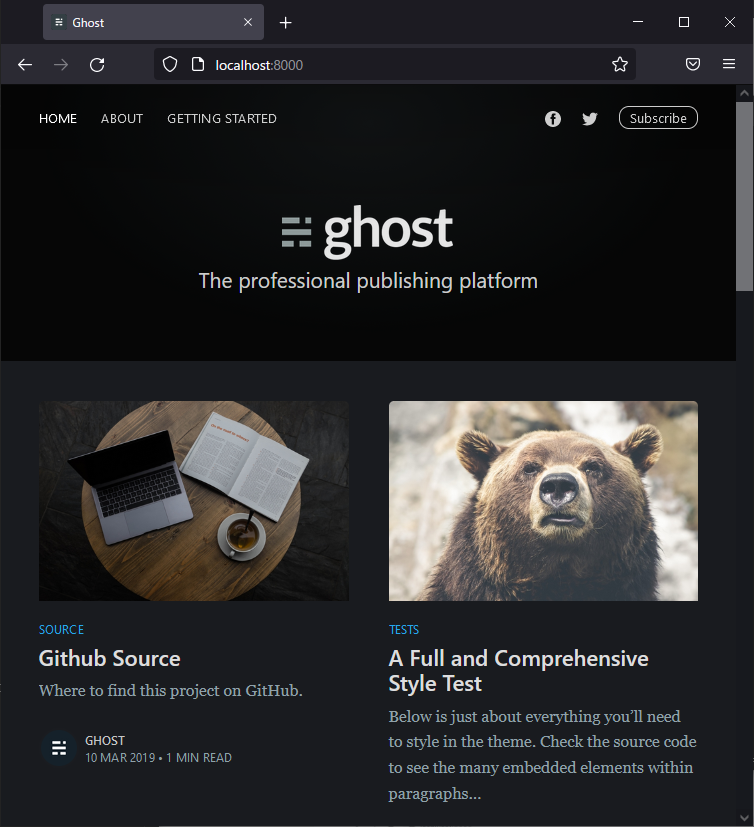
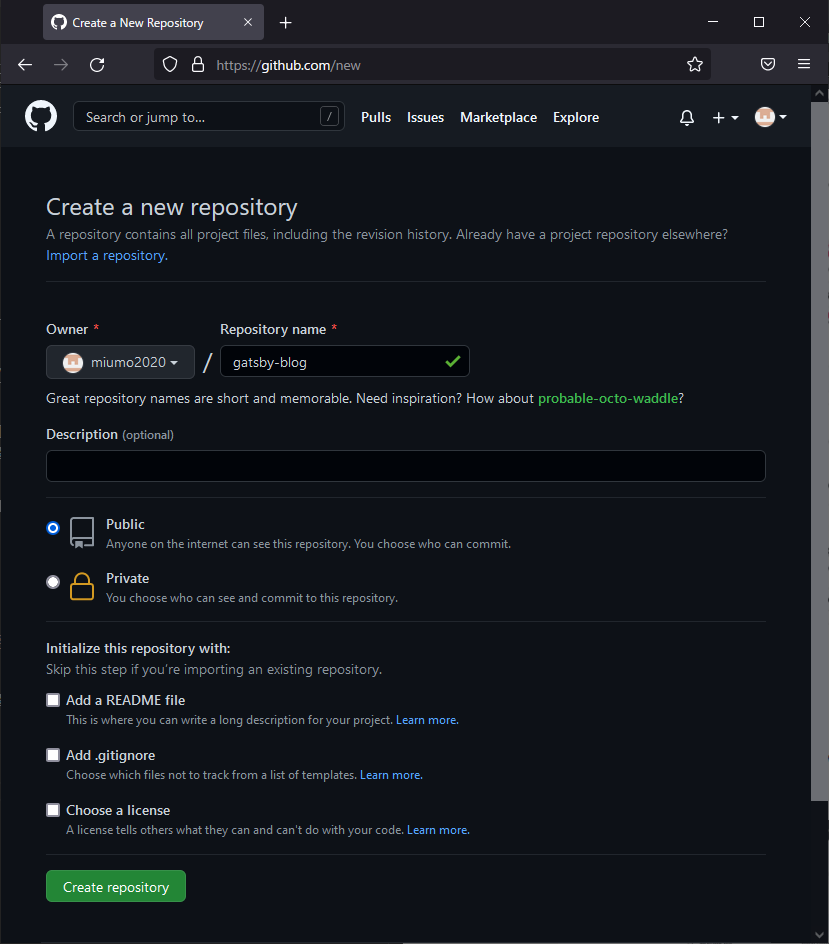

このブログを作った時の備忘録。

---

# 実行環境

- Windows 10 Home
- Node.js v16.8.0.
- npm --version 7.21.0


# Node.jsインストール

公式サイトからインストーラをダウンロードします。
今回は最新版をインストールしました。

[https://nodejs.org/ja/](https://nodejs.org/ja/)




# Gatsbyインストール

コマンドプロンプトから下記コマンドを実行。
いろいろなウェブサイトを見ていると`npm install -g gatsby-cli`としてグローバルにインストールしている例もありますが、今回はGatsby用のパッケージフォルダを作成しました。

```sh
npm init
npm install gatsby-cli
```


# Gatsby Starterを使ってサイト生成

CLIコマンドを実行しサイト生成します。

```sh
npx gatsby new blog https://github.com/scttcper/gatsby-casper
```

ビジュアルがかっこよかったので[gatsby-casper](https://www.gatsbyjs.com/starters-next/scttcper/gatsby-casper/)を使いました。
サイト名「blog」は任意です。

生成が完了したらディレクトリ移動し、開発用サーバを起動します。

```sh
cd blog
npx gatsby develop
```

ブラウザで[http://localhost:8000/](http://localhost:8000/)にアクセスし、以下の様な画面が表示されれば成功です。




# GitHub Pagesの設定

GitHub → New Repository → 任意のRepository name入力 → Create repository

